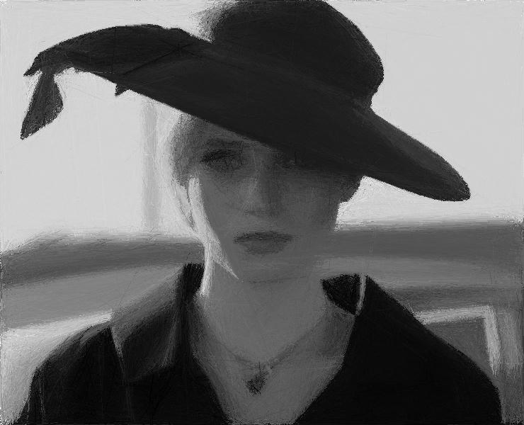

# Gossamer

## Making images. The worst possible way. Because reasons.

Gossamer is a tool for computational image approximation by applying a fitness function iteratively to a target image. The sequence looks roughly like this:

1. Create a blank canvas from a target image
2. Place a random line on the canvas while keeping a copy of the previous canvas
3. Use a fitness function to compare the canvas to the target image and the previous canvas to the target image. If the new canvas is more fit than the old canvas then discard the old canvas and proceed with the new canvas. If the new canvas is less fit then discard it.
4. Go to step 2

This is not a clever way of producing images. It's not a good way of producing images. But it does yield some rather pretty results.

By default Gossamer will use [Peak Signal to Noise Ratio](https://en.wikipedia.org/wiki/Peak_signal-to-noise_ratio) as a proxy for image fitness. This can be changed via the cli to use [Mean Squared Error](https://en.wikipedia.org/wiki/Mean_squared_error). There isn't a huge difference here, PSNR produces slightly better results over the long term at a very small speed tradeoff. [SSIM](https://en.wikipedia.org/wiki/Structural_similarity) is planned as a feature in the near future. This should result in a more significant speed/quality tradeoff.

## Getting Started

The first thing you want to do is probably not pull and run this code. This code will turn one of your logical cores into a space heater for as long as you run it since we're doing image processing in a tight loop. If you do want to pull the code because you hate your computer then a cli is provided for coordinating the code within. Gossamer has 2 modes of operation and it's up to you to coordinate them as you see fit.

## Producing Images

You absolutely want to run this portion of the code in release mode. Running this in release mode is the difference between producing something interesting in minutes and producing something interesting in hours.

You'll need to pass both the --imagepath and --outputpath command line options to run the program. Other options are... well.. optional and can be examined through the cli or by reading the source code you lazy muppet. It's highly, highly recommended that you resize input images if you want reasonable output in sensible timeframes. To test out what you're going to get, an image of roughly 100x100 is nice and should produce something within minutes. Once you know that you're going to get some output that you like you can redo with a larger downscale.

By default Rust will try and create a binary that works on many architectures. If you think you have a CPU that has some slick features and Rust may be able to take advantage of those you can turn on the cpu-native RUSTFLAG.

The command below should compile with aggressive optimisations and then begin a new run with a rescale of the input image to a 200 pixel height while maintaining the aspect ratio.

`RUSTFLAGS="-C target-cpu=native" cargo run --release new -i ./sample/scene.jpg -o output -h 200`

You can then watch the newly created output folder for the output images. Once you have enough images (there isn't a correct answer here, just use your eyeballs to check if you have something you like) you can move onto the next step. The process won't terminate naturally so you'll have to kill it yourself.

## Rolling it into a Gif

Once you have enough images you can run the cli in rollup mode with the --inputfolder set to the folder you've just produced. This will produce a video gif of the whole process sped up. Example is provided below.

`RUSTFLAGS="-C target-cpu=native" cargo run --release rollup -i output`

This is a much, much faster operation than producing the actual images. I've provided the above example with the compiler flags set because I'm lazy and obviously changing the flags will cause cargo to rebuild the whole thing from scratch. You can also just be a normal human and use the binary that was produced in previous runs.

## Resuming Operation on a Previous Image

This currently isn't supported because I'm lazy.
